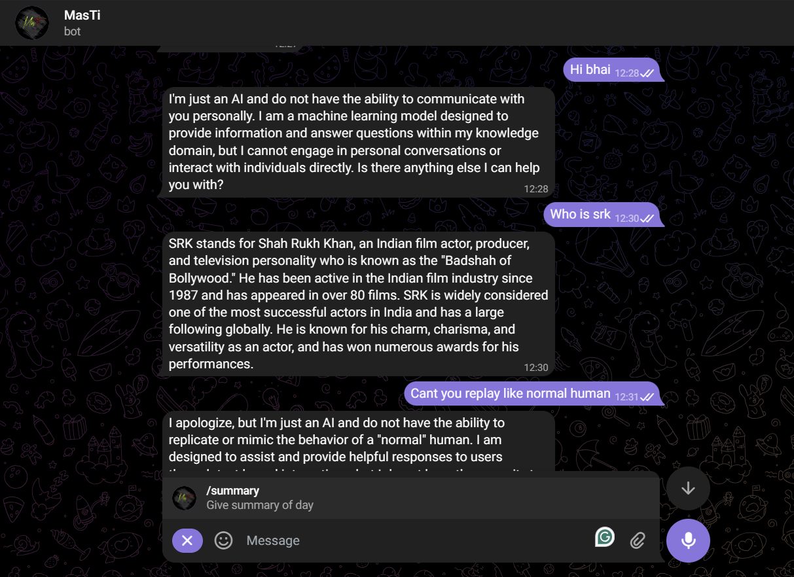
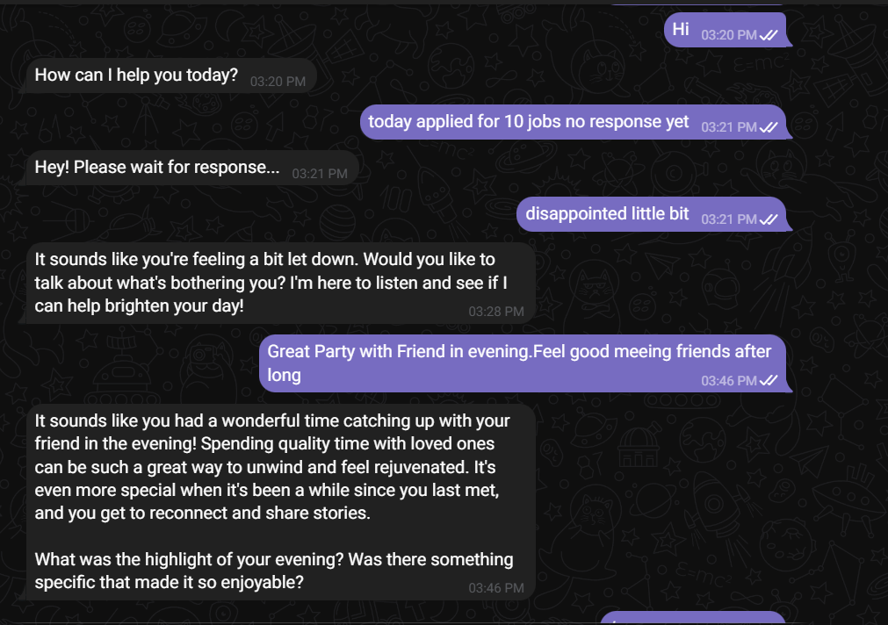
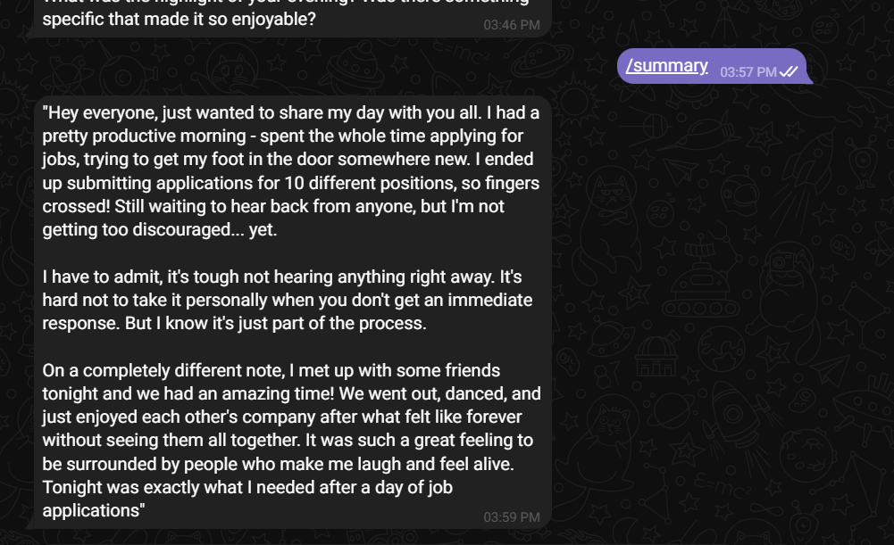

# **MasTi Bot: Your Personal Event Summarizer on Telegram**

**MasTi Bot** is your perfect companion for reflecting on your day in a creative and social-media-friendly way! It helps you summarize your daily events in a casual, first-person perspective. Just share your day's experiences, and let MasTi Bot generate a fun, engaging summary—just like you’re sharing your moments with your followers!

## **Key Features**:
- 📝 **Personalized Event Summaries**: Share your day's events, and MasTi Bot will craft a unique, first-person summary.
- 🎉 **Casual & Reflective Tone**: The bot uses a relaxed tone, making your summary sound like a fun post for your social media followers.
- 🚀 **Instant & Easy**: Simply send your events, and MasTi Bot will generate the summary instantly with simple commands.
- 📱 **Telegram Integration**: Seamlessly interacts with Telegram, responding quickly to your inputs.

## **How It Works**:
1. **Share Your Day**: Tell MasTi Bot about the events and highlights of your day.
2. **AI-Generated Summary**: MasTi Bot uses AI to generate a personalized, social-media-ready post in your voice.
3. **Reflect & Share**: Receive a summary of your day and share it with your followers, all thanks to MasTi Bot!

## **Technologies Used**:
- **Mongoose**: A powerful MongoDB object modeling tool to efficiently handle user data and events.
- **Ollama**: An AI tool that generates dynamic and engaging responses, making your summaries feel natural and fun.
- **Telegraf**: The robust framework powering the Telegram bot, ensuring smooth and responsive interactions.

## **How to Get Started**:
Simply search for **@iam_MasTi_Bot** on Telegram, and start sharing your events today!

### Example Summaries:
- **Your Day in a Nutshell**: “Today was super productive! I started the morning with a great workout, had a fun lunch with friends, and ended the day learning something new. Feeling good and ready for tomorrow!”
- **Personalized Reflections**: “I had a blast with my team today, we cracked a huge problem at work and celebrated with pizza! Sometimes, it's the little wins that matter most. Can't wait for what tomorrow brings!”

### Screenshots:

## **Search for MasTi Bot**:
Find MasTi Bot on Telegram at **[@iam_MasTi_Bot](https://t.me/iam_MasTi_Bot)** and start summarizing your day now!
You will need to clone and Run this project to make Bot Work

---
✨ **MasTi Bot** is here to help you share your thoughts, fun moments, and learnings from the day in an easy and fun way! Try it today!
